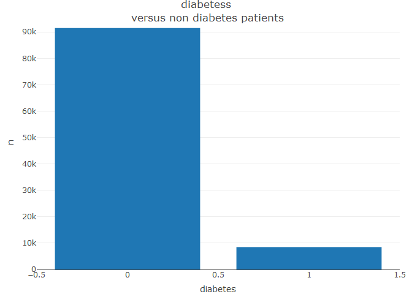
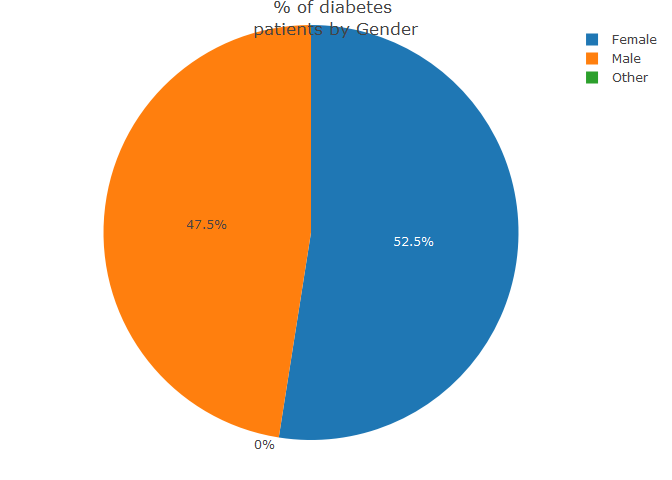
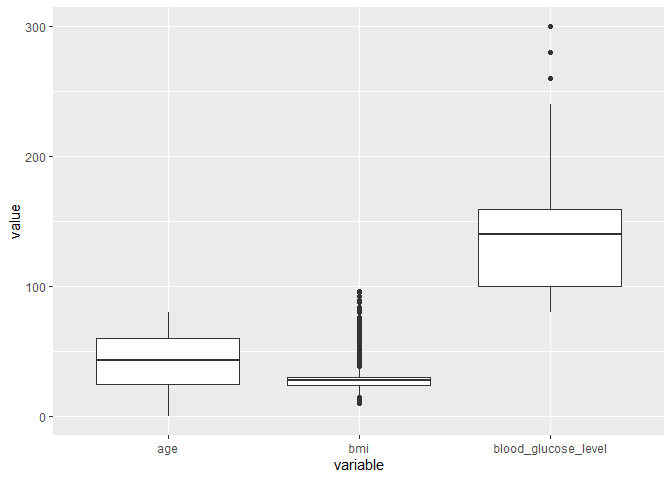
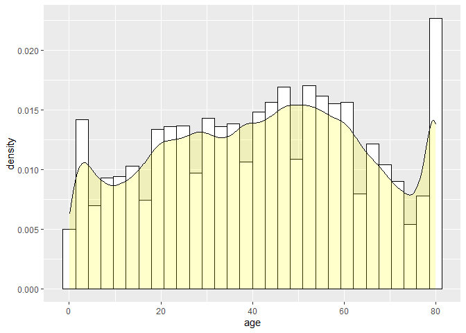
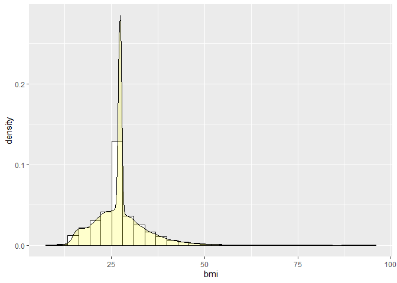
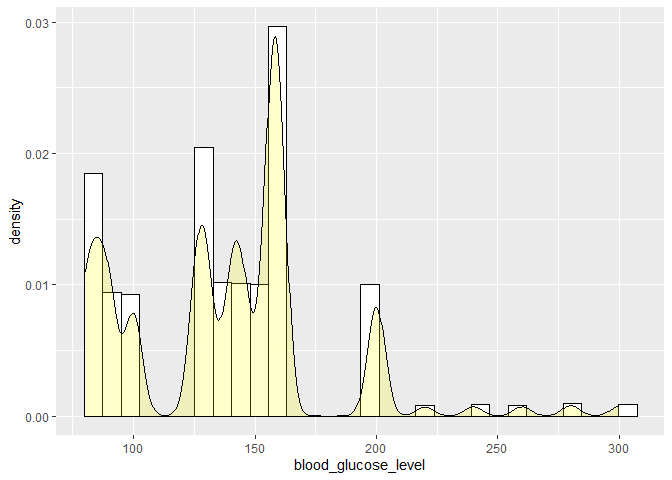
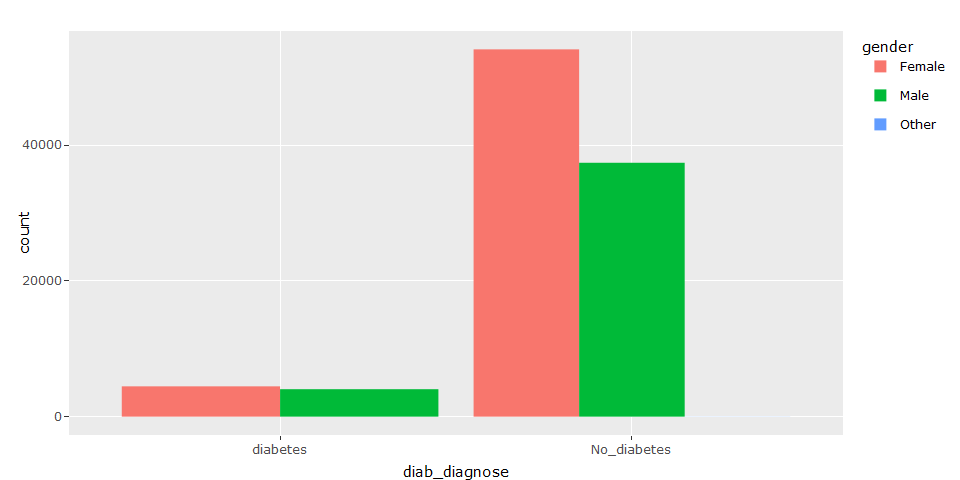
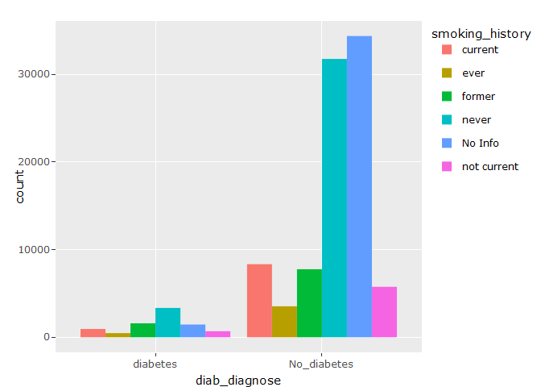
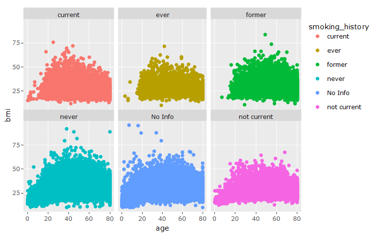
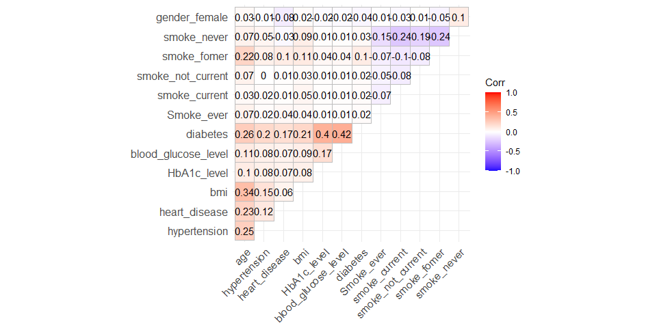

R Notebook
================

The Diabetes prediction dataset is a collection of medical and
demographic data from patients, along with their diabetes status
(positive or negative). The data includes features such as age, gender,
body mass index (BMI), hypertension, heart disease, smoking history,
HbA1c level, and blood glucose level. This dataset can be used to build
machine learning models to predict diabetes in patients based on their
medical history and demographic information. This can be useful for
healthcare professionals in identifying patients who may be at risk of
developing diabetes and in developing personalized treatment plans.
Additionally, the dataset can be used by researchers to explore the
relationships between various medical and demographic factors and the
likelihood of developing diabetes. source:
<https://www.kaggle.com/datasets/iammustafatz/diabetes-prediction-dataset>

``` r
rm(list=ls())
setwd("C:/Users/49162/OneDrive/Desktop/All_documents/Kaggle/diabetes_pred/R_script")
 data_1 <-read.csv("diabetes_prediction_dataset.csv")
```

## Loading packages

``` r
library(tidyverse)
```

    ## Warning: Paket 'ggplot2' wurde unter R Version 4.2.3 erstellt

    ## Warning: Paket 'tibble' wurde unter R Version 4.2.3 erstellt

    ## Warning: Paket 'dplyr' wurde unter R Version 4.2.3 erstellt

    ## ── Attaching core tidyverse packages ──────────────────────── tidyverse 2.0.0 ──
    ## ✔ dplyr     1.1.2     ✔ readr     2.1.4
    ## ✔ forcats   1.0.0     ✔ stringr   1.5.0
    ## ✔ ggplot2   3.4.2     ✔ tibble    3.2.1
    ## ✔ lubridate 1.9.2     ✔ tidyr     1.3.0
    ## ✔ purrr     1.0.1     
    ## ── Conflicts ────────────────────────────────────────── tidyverse_conflicts() ──
    ## ✖ dplyr::filter() masks stats::filter()
    ## ✖ dplyr::lag()    masks stats::lag()
    ## ℹ Use the conflicted package (<http://conflicted.r-lib.org/>) to force all conflicts to become errors

``` r
library(plotly)
```

    ## 
    ## Attache Paket: 'plotly'
    ## 
    ## Das folgende Objekt ist maskiert 'package:ggplot2':
    ## 
    ##     last_plot
    ## 
    ## Das folgende Objekt ist maskiert 'package:stats':
    ## 
    ##     filter
    ## 
    ## Das folgende Objekt ist maskiert 'package:graphics':
    ## 
    ##     layout

``` r
library(tidymodels)
```

    ## Warning: Paket 'tidymodels' wurde unter R Version 4.2.3 erstellt

    ## ── Attaching packages ────────────────────────────────────── tidymodels 1.1.0 ──
    ## ✔ broom        1.0.4     ✔ rsample      1.1.1
    ## ✔ dials        1.2.0     ✔ tune         1.1.1
    ## ✔ infer        1.0.4     ✔ workflows    1.1.3
    ## ✔ modeldata    1.1.0     ✔ workflowsets 1.0.1
    ## ✔ parsnip      1.1.0     ✔ yardstick    1.2.0
    ## ✔ recipes      1.0.6

    ## Warning: Paket 'broom' wurde unter R Version 4.2.3 erstellt

    ## Warning: Paket 'dials' wurde unter R Version 4.2.3 erstellt

    ## Warning: Paket 'infer' wurde unter R Version 4.2.3 erstellt

    ## Warning: Paket 'modeldata' wurde unter R Version 4.2.3 erstellt

    ## Warning: Paket 'parsnip' wurde unter R Version 4.2.3 erstellt

    ## Warning: Paket 'recipes' wurde unter R Version 4.2.3 erstellt

    ## Warning: Paket 'rsample' wurde unter R Version 4.2.3 erstellt

    ## Warning: Paket 'tune' wurde unter R Version 4.2.3 erstellt

    ## Warning: Paket 'workflows' wurde unter R Version 4.2.3 erstellt

    ## Warning: Paket 'workflowsets' wurde unter R Version 4.2.3 erstellt

    ## Warning: Paket 'yardstick' wurde unter R Version 4.2.3 erstellt

    ## ── Conflicts ───────────────────────────────────────── tidymodels_conflicts() ──
    ## ✖ scales::discard() masks purrr::discard()
    ## ✖ plotly::filter()  masks dplyr::filter(), stats::filter()
    ## ✖ recipes::fixed()  masks stringr::fixed()
    ## ✖ dplyr::lag()      masks stats::lag()
    ## ✖ yardstick::spec() masks readr::spec()
    ## ✖ recipes::step()   masks stats::step()
    ## • Learn how to get started at https://www.tidymodels.org/start/

``` r
library(reshape2)
```

    ## 
    ## Attache Paket: 'reshape2'
    ## 
    ## Das folgende Objekt ist maskiert 'package:tidyr':
    ## 
    ##     smiths

## Looking at the data

``` r
dim(data_1)
```

    ## [1] 100000      9

``` r
names(data_1)
```

    ## [1] "gender"              "age"                 "hypertension"       
    ## [4] "heart_disease"       "smoking_history"     "bmi"                
    ## [7] "HbA1c_level"         "blood_glucose_level" "diabetes"

``` r
str(data_1)
```

    ## 'data.frame':    100000 obs. of  9 variables:
    ##  $ gender             : chr  "Female" "Female" "Male" "Female" ...
    ##  $ age                : num  80 54 28 36 76 20 44 79 42 32 ...
    ##  $ hypertension       : int  0 0 0 0 1 0 0 0 0 0 ...
    ##  $ heart_disease      : int  1 0 0 0 1 0 0 0 0 0 ...
    ##  $ smoking_history    : chr  "never" "No Info" "never" "current" ...
    ##  $ bmi                : num  25.2 27.3 27.3 23.4 20.1 ...
    ##  $ HbA1c_level        : num  6.6 6.6 5.7 5 4.8 6.6 6.5 5.7 4.8 5 ...
    ##  $ blood_glucose_level: int  140 80 158 155 155 85 200 85 145 100 ...
    ##  $ diabetes           : int  0 0 0 0 0 0 1 0 0 0 ...

## Converting data to tibble

``` r
data_1 <- as_tibble(data_1)
head(data_1)
```

    ## # A tibble: 6 × 9
    ##   gender   age hypertension heart_disease smoking_history   bmi HbA1c_level
    ##   <chr>  <dbl>        <int>         <int> <chr>           <dbl>       <dbl>
    ## 1 Female    80            0             1 never            25.2         6.6
    ## 2 Female    54            0             0 No Info          27.3         6.6
    ## 3 Male      28            0             0 never            27.3         5.7
    ## 4 Female    36            0             0 current          23.4         5  
    ## 5 Male      76            1             1 current          20.1         4.8
    ## 6 Female    20            0             0 never            27.3         6.6
    ## # ℹ 2 more variables: blood_glucose_level <int>, diabetes <int>

## Searching for missing numbers

``` r
apply(is.na(data_1), 2, sum)
```

    ##              gender                 age        hypertension       heart_disease 
    ##                   0                   0                   0                   0 
    ##     smoking_history                 bmi         HbA1c_level blood_glucose_level 
    ##                   0                   0                   0                   0 
    ##            diabetes 
    ##                   0

## Some basic summary stats.

``` r
summary(data_1)
```

    ##     gender               age         hypertension     heart_disease    
    ##  Length:100000      Min.   : 0.08   Min.   :0.00000   Min.   :0.00000  
    ##  Class :character   1st Qu.:24.00   1st Qu.:0.00000   1st Qu.:0.00000  
    ##  Mode  :character   Median :43.00   Median :0.00000   Median :0.00000  
    ##                     Mean   :41.89   Mean   :0.07485   Mean   :0.03942  
    ##                     3rd Qu.:60.00   3rd Qu.:0.00000   3rd Qu.:0.00000  
    ##                     Max.   :80.00   Max.   :1.00000   Max.   :1.00000  
    ##  smoking_history         bmi         HbA1c_level    blood_glucose_level
    ##  Length:100000      Min.   :10.01   Min.   :3.500   Min.   : 80.0      
    ##  Class :character   1st Qu.:23.63   1st Qu.:4.800   1st Qu.:100.0      
    ##  Mode  :character   Median :27.32   Median :5.800   Median :140.0      
    ##                     Mean   :27.32   Mean   :5.528   Mean   :138.1      
    ##                     3rd Qu.:29.58   3rd Qu.:6.200   3rd Qu.:159.0      
    ##                     Max.   :95.69   Max.   :9.000   Max.   :300.0      
    ##     diabetes    
    ##  Min.   :0.000  
    ##  1st Qu.:0.000  
    ##  Median :0.000  
    ##  Mean   :0.085  
    ##  3rd Qu.:0.000  
    ##  Max.   :1.000

## looking into variables with character vectors

``` r
unique(data_1[["gender"]])
```

    ## [1] "Female" "Male"   "Other"

``` r
unique(data_1[["smoking_history"]])
```

    ## [1] "never"       "No Info"     "current"     "former"      "ever"       
    ## [6] "not current"

## Some visualization

``` r
data_plot <- data_1 %>%
              select(diabetes, gender,smoking_history,
                    heart_disease,age, hypertension, bmi,
                    blood_glucose_level)%>%
                    mutate(diab_diagnose =
                      ifelse(diabetes==0,
                       "No_diabetes", "diabetes"))

fig <- data_1 %>% count(diabetes)
fig <- fig%>% plot_ly(x=~diabetes,y=~n, type = "bar" )
fig <- fig %>% layout(title =  "diabetess
                      versus non diabetes patients")
fig
```

<!-- -->

``` r
#p <- ggplot(data_1, aes(x=diabetes)) + 
#       geom_bar() 
#ggplotly(p)
```

``` r
fig <- plot_ly(data_1, labels = ~gender, 
            values = ~diabetes, type = 'pie')
fig <- fig %>% layout(title =
      '% of diabetes 
      patients by Gender')
fig
```

<!-- -->

``` r
female <- data_1 %>% filter(gender == "Female") %>%
      count()
male <- data_1 %>% filter(gender == "Male") %>%
      count()
total_gender <- bind_cols(female, male)
```

    ## New names:
    ## • `n` -> `n...1`
    ## • `n` -> `n...2`

``` r
colnames(total_gender) <- c("female", "male")
total_gender
```

    ## # A tibble: 1 × 2
    ##   female  male
    ##    <int> <int>
    ## 1  58552 41430

``` r
box_data <- data_1 %>% select(age, bmi, blood_glucose_level)

data_long1 <- melt(box_data)                                   
```

    ## No id variables; using all as measure variables

``` r
ggplot(data_long1, aes(x = variable, y = value)) +         
     geom_boxplot()
```

<!-- -->

``` r
ggplot(data_1, aes(x=age)) + 
geom_histogram(aes(y=..density..), colour="black", fill="white")+
 geom_density(alpha=.2, fill="yellow")
```

    ## Warning: The dot-dot notation (`..density..`) was deprecated in ggplot2 3.4.0.
    ## ℹ Please use `after_stat(density)` instead.
    ## This warning is displayed once every 8 hours.
    ## Call `lifecycle::last_lifecycle_warnings()` to see where this warning was
    ## generated.

    ## `stat_bin()` using `bins = 30`. Pick better value with `binwidth`.

<!-- -->

``` r
ggplot(data_1, aes(x=bmi)) + 
geom_histogram(aes(y=..density..), colour="black", fill="white")+
 geom_density(alpha=.2, fill="yellow")
```

    ## `stat_bin()` using `bins = 30`. Pick better value with `binwidth`.

<!-- -->

``` r
ggplot(data_1, aes(x=blood_glucose_level)) + 
geom_histogram(aes(y=..density..), colour="black", fill="white")+
 geom_density(alpha=.2, fill="yellow")
```

    ## `stat_bin()` using `bins = 30`. Pick better value with `binwidth`.

<!-- -->

``` r
p<- ggplot(data_plot) + geom_bar(mapping = 
          aes(diab_diagnose, 
              fill=gender), position="dodge")
ggplotly(p)
```



``` r
p<- ggplot(data_plot) + geom_bar(mapping = 
          aes(diab_diagnose, 
              fill=smoking_history), position="dodge")
ggplotly(p)
```

<!-- -->

``` r
p1 <- ggplot(data=data_plot) + geom_point(mapping = aes( age,bmi,  color=smoking_history))+
  facet_wrap(~ smoking_history)

ggplotly(p1)
```



## Converting Smooking history and gender to dummies

``` r
data_1 <- data_1 %>% mutate(Smoke_ever = ifelse(
                            smoking_history== "ever" , 1, 0),
                 smoke_current = ifelse(
                           smoking_history == "current" ,1, 0),
                  smoke_not_current = ifelse(
                           smoking_history == "not current",1,0),
                  smoke_fomer = ifelse(
                           smoking_history== "former",1, 0),
                  smoke_never = ifelse(
                          smoking_history == "never", 1, 0
        
))


data_1 <- data_1 %>% mutate(gender_female = ifelse(
                           gender == "Female" ,1, 0),
                            )


data_1 <- data_1%>% select(!c(smoking_history, gender))
```

``` r
str(data_1)
```

    ## tibble [100,000 × 13] (S3: tbl_df/tbl/data.frame)
    ##  $ age                : num [1:100000] 80 54 28 36 76 20 44 79 42 32 ...
    ##  $ hypertension       : int [1:100000] 0 0 0 0 1 0 0 0 0 0 ...
    ##  $ heart_disease      : int [1:100000] 1 0 0 0 1 0 0 0 0 0 ...
    ##  $ bmi                : num [1:100000] 25.2 27.3 27.3 23.4 20.1 ...
    ##  $ HbA1c_level        : num [1:100000] 6.6 6.6 5.7 5 4.8 6.6 6.5 5.7 4.8 5 ...
    ##  $ blood_glucose_level: int [1:100000] 140 80 158 155 155 85 200 85 145 100 ...
    ##  $ diabetes           : int [1:100000] 0 0 0 0 0 0 1 0 0 0 ...
    ##  $ Smoke_ever         : num [1:100000] 0 0 0 0 0 0 0 0 0 0 ...
    ##  $ smoke_current      : num [1:100000] 0 0 0 1 1 0 0 0 0 0 ...
    ##  $ smoke_not_current  : num [1:100000] 0 0 0 0 0 0 0 0 0 0 ...
    ##  $ smoke_fomer        : num [1:100000] 0 0 0 0 0 0 0 0 0 0 ...
    ##  $ smoke_never        : num [1:100000] 1 0 1 0 0 1 1 0 1 1 ...
    ##  $ gender_female      : num [1:100000] 1 1 0 1 0 1 1 1 0 1 ...

``` r
#data_1$gender <- as.numeric(data_1$gender)
#data_1$smoking_history <- as.numeric(data_1$smoking_history)#
#data_1$diabetes <- as.numeric(data_1$diabetes)
```

## Correlation plot

``` r
corrr <- round(cor(data_1),2)
ggcorrplot::ggcorrplot(corrr, lab =T, type="upper")
```



``` r
dim(data_1)
```

    ## [1] 100000     13

## Model Logistics regression for inference

``` r
names(data_1)
```

    ##  [1] "age"                 "hypertension"        "heart_disease"      
    ##  [4] "bmi"                 "HbA1c_level"         "blood_glucose_level"
    ##  [7] "diabetes"            "Smoke_ever"          "smoke_current"      
    ## [10] "smoke_not_current"   "smoke_fomer"         "smoke_never"        
    ## [13] "gender_female"

``` r
data_1$diabetes <- as.factor(data_1$diabetes)

mod1 <- logistic_reg() %>% 
  set_engine("glm") %>% set_mode("classification")%>%
    fit(diabetes ~., data = data_1)

mod1 %>% extract_fit_engine() %>% summary()
```

    ## 
    ## Call:
    ## stats::glm(formula = diabetes ~ ., family = stats::binomial, 
    ##     data = data)
    ## 
    ## Deviance Residuals: 
    ##     Min       1Q   Median       3Q      Max  
    ## -2.7657  -0.1962  -0.0664  -0.0173   3.8134  
    ## 
    ## Coefficients:
    ##                       Estimate Std. Error z value Pr(>|z|)    
    ## (Intercept)         -2.754e+01  2.924e-01 -94.207  < 2e-16 ***
    ## age                  4.620e-02  1.126e-03  41.042  < 2e-16 ***
    ## hypertension         7.414e-01  4.710e-02  15.740  < 2e-16 ***
    ## heart_disease        7.348e-01  6.072e-02  12.101  < 2e-16 ***
    ## bmi                  8.895e-02  2.555e-03  34.819  < 2e-16 ***
    ## HbA1c_level          2.340e+00  3.577e-02  65.415  < 2e-16 ***
    ## blood_glucose_level  3.336e-02  4.821e-04  69.209  < 2e-16 ***
    ## Smoke_ever           6.797e-01  8.541e-02   7.957 1.76e-15 ***
    ## smoke_current        7.307e-01  6.651e-02  10.985  < 2e-16 ***
    ## smoke_not_current    5.180e-01  7.489e-02   6.917 4.63e-12 ***
    ## smoke_fomer          6.222e-01  5.978e-02  10.408  < 2e-16 ***
    ## smoke_never          5.739e-01  4.888e-02  11.742  < 2e-16 ***
    ## gender_female       -2.721e-01  3.613e-02  -7.531 5.04e-14 ***
    ## ---
    ## Signif. codes:  0 '***' 0.001 '**' 0.01 '*' 0.05 '.' 0.1 ' ' 1
    ## 
    ## (Dispersion parameter for binomial family taken to be 1)
    ## 
    ##     Null deviance: 58163  on 99999  degrees of freedom
    ## Residual deviance: 22629  on 99987  degrees of freedom
    ## AIC: 22655
    ## 
    ## Number of Fisher Scoring iterations: 8

## Splitting data for prediction

``` r
set.seed(1234)
data_split <- initial_split(data_1, prop=0.7, 
                            strata = "diabetes")

train_data <- training(data_split)
test_data <- testing(data_split)

dim(train_data)
```

    ## [1] 70000    13

``` r
dim(test_data)
```

    ## [1] 30000    13

## Mod 1 : Logistics regression classifier

``` r
train_mod <- logistic_reg()%>%
     set_engine("glm")  %>% set_mode("classification")%>%
         fit(diabetes ~., data = train_data)


test_mod <- predict(train_mod,
                    new_data = test_data,
                    type="class")


#conf_mod <- predict(train_mod,
#                    new_data = test_data,
#                    type="conf_int")


results_diab <- test_data %>%
           select(diabetes) %>% bind_cols(test_mod)

 conf_mat(results_diab, truth = diabetes,
         estimate = .pred_class)
```

    ##           Truth
    ## Prediction     0     1
    ##          0 27216   945
    ##          1   227  1612

``` r
accuracy(results_diab, truth = diabetes,
         estimate = .pred_class)
```

    ## # A tibble: 1 × 3
    ##   .metric  .estimator .estimate
    ##   <chr>    <chr>          <dbl>
    ## 1 accuracy binary         0.961

``` r
#sens(results_diab, truth = diabetes,
#        estimate = .pred_class)
```

## Decision tree classifier

``` r
tree_mod <- decision_tree() %>%
      set_engine("rpart") %>%
         set_mode("classification")%>%
              fit(diabetes ~., data = train_data)
  
tree_mod %>% extract_fit_engine() %>% summary
```

    ## Call:
    ## rpart::rpart(formula = diabetes ~ ., data = data)
    ##   n= 70000 
    ## 
    ##          CP nsplit rel error    xerror        xstd
    ## 1 0.4570082      0 1.0000000 1.0000000 0.012408847
    ## 2 0.2120141      1 0.5429918 0.5429918 0.009335663
    ## 3 0.0100000      2 0.3309776 0.3309776 0.007357110
    ## 
    ## Variable importance
    ##         HbA1c_level blood_glucose_level 
    ##                  67                  33 
    ## 
    ## Node number 1: 70000 observations,    complexity param=0.4570082
    ##   predicted class=0  expected loss=0.0849  P(node) =1
    ##     class counts: 64057  5943
    ##    probabilities: 0.915 0.085 
    ##   left son=2 (67284 obs) right son=3 (2716 obs)
    ##   Primary splits:
    ##       HbA1c_level         < 6.7    to the left,  improve=4732.4180, (0 missing)
    ##       blood_glucose_level < 210    to the left,  improve=3911.3650, (0 missing)
    ##       age                 < 53.5   to the left,  improve= 672.0017, (0 missing)
    ##       hypertension        < 0.5    to the left,  improve= 439.0913, (0 missing)
    ##       bmi                 < 29.165 to the left,  improve= 402.9294, (0 missing)
    ## 
    ## Node number 2: 67284 observations,    complexity param=0.2120141
    ##   predicted class=0  expected loss=0.04796088  P(node) =0.9612
    ##     class counts: 64057  3227
    ##    probabilities: 0.952 0.048 
    ##   left son=4 (66024 obs) right son=5 (1260 obs)
    ##   Primary splits:
    ##       blood_glucose_level < 210    to the left,  improve=2327.6630, (0 missing)
    ##       age                 < 53.5   to the left,  improve= 223.4959, (0 missing)
    ##       HbA1c_level         < 5.35   to the left,  improve= 202.4460, (0 missing)
    ##       bmi                 < 29.595 to the left,  improve= 149.1933, (0 missing)
    ##       hypertension        < 0.5    to the left,  improve= 145.9774, (0 missing)
    ## 
    ## Node number 3: 2716 observations
    ##   predicted class=1  expected loss=0  P(node) =0.0388
    ##     class counts:     0  2716
    ##    probabilities: 0.000 1.000 
    ## 
    ## Node number 4: 66024 observations
    ##   predicted class=0  expected loss=0.0297922  P(node) =0.9432
    ##     class counts: 64057  1967
    ##    probabilities: 0.970 0.030 
    ## 
    ## Node number 5: 1260 observations
    ##   predicted class=1  expected loss=0  P(node) =0.018
    ##     class counts:     0  1260
    ##    probabilities: 0.000 1.000

``` r
tree_pred <- predict(tree_mod, new_data = test_data,
          type= "class")

tree_conf <- test_data %>% select(diabetes)%>%
          bind_cols(tree_pred)

conf_mat(tree_conf, truth = diabetes,
         estimate = .pred_class)
```

    ##           Truth
    ## Prediction     0     1
    ##          0 27443   846
    ##          1     0  1711

``` r
accuracy(tree_conf, truth = diabetes,
         estimate = .pred_class)
```

    ## # A tibble: 1 × 3
    ##   .metric  .estimator .estimate
    ##   <chr>    <chr>          <dbl>
    ## 1 accuracy binary         0.972

## Random forest classifier

``` r
library(randomForest)
```

    ## Warning: Paket 'randomForest' wurde unter R Version 4.2.3 erstellt

    ## randomForest 4.7-1.1

    ## Type rfNews() to see new features/changes/bug fixes.

    ## 
    ## Attache Paket: 'randomForest'

    ## Das folgende Objekt ist maskiert 'package:dplyr':
    ## 
    ##     combine

    ## Das folgende Objekt ist maskiert 'package:ggplot2':
    ## 
    ##     margin

``` r
rf_model <- 
  rand_forest() %>%
  set_engine("ranger") %>%
  set_mode("classification")%>%
  fit(diabetes ~., data = train_data)


rf_mod_test <- predict(rf_model,
                    new_data = test_data,
                    type="class")

results_rf <- test_data%>%select(diabetes)%>%
             bind_cols(rf_mod_test)


conf_mat(results_rf , truth = diabetes,
         estimate = .pred_class)
```

    ##           Truth
    ## Prediction     0     1
    ##          0 27437   832
    ##          1     6  1725

``` r
accuracy(results_rf , truth = diabetes,
         estimate = .pred_class)
```

    ## # A tibble: 1 × 3
    ##   .metric  .estimator .estimate
    ##   <chr>    <chr>          <dbl>
    ## 1 accuracy binary         0.972

``` r
#sens(results_rf , truth = diabetes,
#         estimate = .pred_class)

#test_data %>% select(diabetes) %>%
#         bind_cols(predict(rf_model, test_data))
```

### XG boost classifier

``` r
library(xgboost)
```

    ## Warning: Paket 'xgboost' wurde unter R Version 4.2.3 erstellt

    ## 
    ## Attache Paket: 'xgboost'

    ## Das folgende Objekt ist maskiert 'package:plotly':
    ## 
    ##     slice

    ## Das folgende Objekt ist maskiert 'package:dplyr':
    ## 
    ##     slice

``` r
#parsnip_addin()

boost_mod <-
  boost_tree() %>%
  set_engine('xgboost') %>%
  set_mode('classification') %>%
  fit(diabetes ~., data = train_data)

bst_pred <- predict(boost_mod,
                    new_data = test_data,
                    type = "class")

bost_con <- test_data %>% select(diabetes)%>%
            bind_cols(bst_pred)


conf_mat(bost_con,truth = diabetes,
         estimate = .pred_class)
```

    ##           Truth
    ## Prediction     0     1
    ##          0 27437   835
    ##          1     6  1722

``` r
accuracy(bost_con,truth = diabetes,
         estimate = .pred_class)
```

    ## # A tibble: 1 × 3
    ##   .metric  .estimator .estimate
    ##   <chr>    <chr>          <dbl>
    ## 1 accuracy binary         0.972

``` r
#sen_an <- sens(bost_con,truth = diabetes,
#         estimate = .pred_class)
```

## comparing accuracy of all the models

``` r
 log_reg <- accuracy(results_diab, truth = diabetes,
         estimate = .pred_class)%>% select(.estimate)
d_tree <- accuracy(tree_conf, truth = diabetes,
         estimate = .pred_class)%>% select(.estimate)
 
r_forest <- accuracy(results_rf , truth = diabetes,
         estimate = .pred_class)%>% select(.estimate)
xgboost <- accuracy(bost_con,truth = diabetes,
         estimate = .pred_class) %>% select(.estimate)

comp_mod <-round(bind_cols(log_reg,d_tree,
                           r_forest,xgboost),4)
```

    ## New names:
    ## • `.estimate` -> `.estimate...1`
    ## • `.estimate` -> `.estimate...2`
    ## • `.estimate` -> `.estimate...3`
    ## • `.estimate` -> `.estimate...4`

``` r
colnames(comp_mod) = c("Log_Reg", "D-tree",
                       "R_forest",
                       "Xgboost")


head(comp_mod)
```

    ## # A tibble: 1 × 4
    ##   Log_Reg `D-tree` R_forest Xgboost
    ##     <dbl>    <dbl>    <dbl>   <dbl>
    ## 1   0.961    0.972    0.972   0.972
